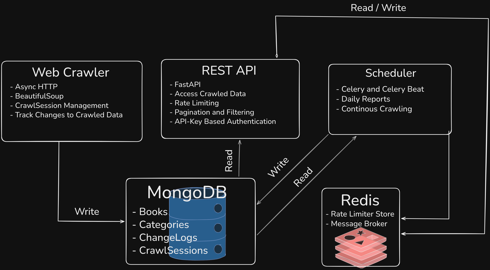
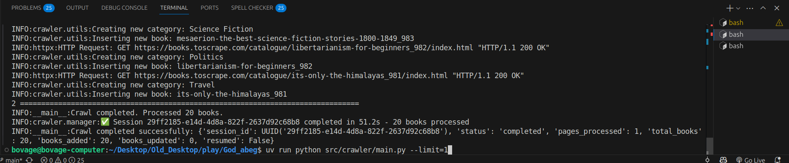
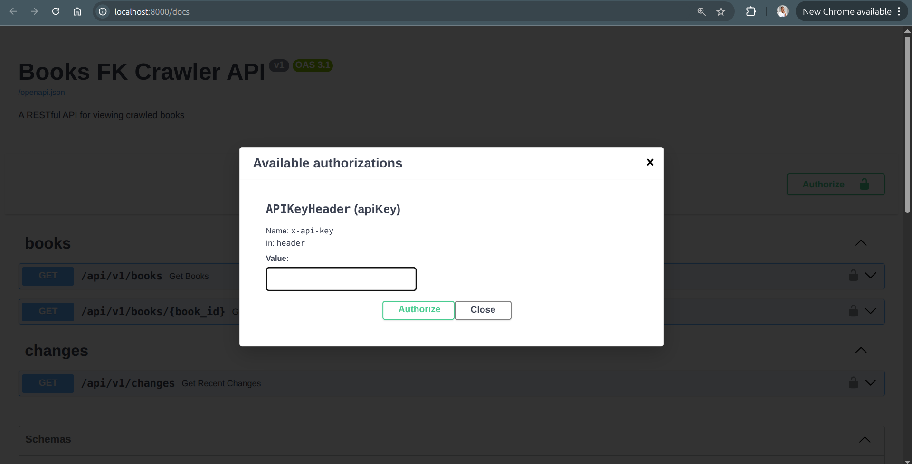
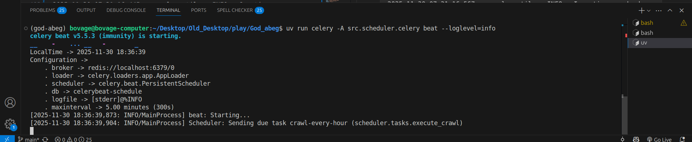
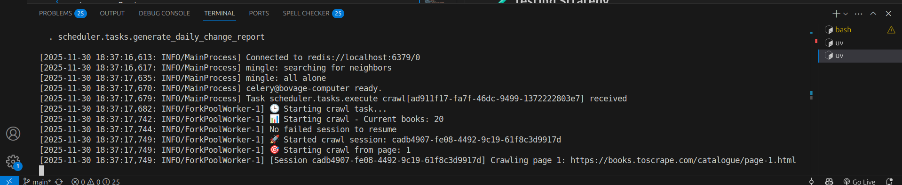
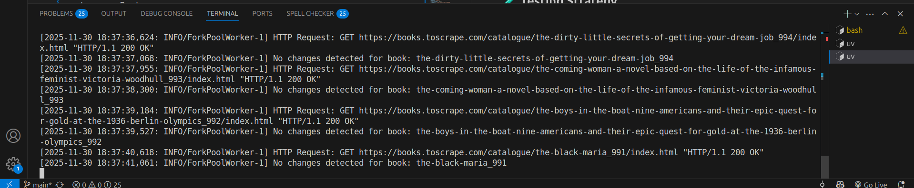

# Book FK Crawler System

A robust and scalable web crawling system that crawls books on the website (https://books.toscrape.com/), tracks changes over time, and provides REST API access with automated reporting capabilities.

## Table of Content

- [Overview](#overview)
- [System Architecture](#system-architecture)
- [Database Design](#database-design)
- [Development Methodology](#development-methodology)
- [Setup Instructions](#setup-instructions)
- [Running the System](#running-the-system)
- [Testing Strategy](#testing-strategy)
- [Trade-offs Made](#trade-offs-made)
- [Screenshots](#screenshots)
- [Recommendation for Production](#recommendation-for-production)

## Overview

This system demonstrates production-ready web crawling architecture featuring:

- **Asynchronous web crawling** with retry logic and crawl session management
- **Change detection mechanism** using content hashing
- **RESTful API** with pagination, filtering, and rate limiting
- **Automated scheduling** with daily reports and error handling
- **Comprehensive testing and logging**

## System Architecture



### Core Technologies

- **Python 3.12** - Modern async/await support and performance improvements
- **MongoDB** - NoSQL database for flexible data storage
- **Redis** - Rate limiter store and message broker
- **Celery and Celery Beat** - Background execution of tasks and Scheduler

### Web Scraping Stack

- **httpx** - Modern async HTTP client with HTTP/2 support
  - _Why chosen_: Async performance compared to the popular requests library, widely used in async python frameworks
- **BeautifulSoup4** - HTML parsing with lxml parser
  - _Why chosen_: Beautiful Soup is an excellent choice for scraping a Server-Side Rendered (SSR) website because the content is readily available in the initial HTML response sent from the server. The [website](https://books.toscrape.com/) is an SSR and not Client-Side Rendered (CSR), therefore Beautiful Soup can efficiently parse it.
- **tenacity** - Retry logic with exponential backoff
  - _Why chosen_: Configurable retry strategies for handling transient network issues

### Web Framework

- **FastAPI** - Modern async web framework
  - _Why chosen_: Automatic OpenAPI docs, excellent async support, built-in validation, type safety
- **Beanie** - Async MongoDB ODM
  - _Why chosen_: Pydantic integration, modern async/await patterns, excellent type support

### Task Scheduling

- **Celery** - Distributed task queue
  - _Why chosen_: Proven reliability for background tasks, flexible scheduling, robust error handling
- **Redis** - Message broker for Celery and store for rate limiting
  - _Why chosen_: Fast, reliable, perfect for task queuing and rate limiting

### Testing & Quality

- **pytest** - Testing framework with async support
- **pytest-asyncio** - Async test support
- **httpx** - Test client for API testing

## Key Design Decisions & Rationale

### 1. Service Layer Architecture

**Decision**: Separated business logic into service classes

**Rationale**:

- Routes handle only HTTP concerns (request/response)
- Business logic can be reused across CLI, API, or background tasks
- Easier unit testing and maintenance
- Clean separation of concerns following DDD principles

### 2. Content Change Detection via Hashing

**Implementation**: MD5 hash of special fields of the book data

**Assumption**: Not all the fields of a book are subjected to changes. The fields that are critical and subjected to changes are used to generate hash.

```py
BOOK_FIELDS_TO_TRACK: List[str] = [
    "currency",
    "price_with_tax",
    "price_without_tax",
    "availability",
    "no_of_reviews",
    "no_of_ratings",
]
```

**Rationale**:

- Detects any meaningful content changes automatically (when hash of a new book data does not match the hash of existing document in the database)
- Excludes metadata that shouldn't trigger updates (timestamps, URLs)
- Configurable field tracking via constants

### 3. Async-First Architecture

**Decision**: Built entire system on async/await patterns

**Rationale**:

- Handles thousands of concurrent HTTP requests efficiently
- Single-threaded concurrency reduces complexity and debugging
- Natural fit for I/O-bound web scraping operations
- Better resource utilization than thread-based approaches

### 4. Session Management & Resume Capability

**Implementation**: CrawlSession collection tracks crawl task progress

**Rationale**:

- Treats crawling as task that has state, so it can be resumed in case of failure
- Prevents duplicate work on resume, saving time and resources
- Provides comprehensive audit trail of crawl operations
- Enables debugging and optimization of crawl patterns using the crawl operations data

### 5. Robust Error Handling Strategy

**Implementation**: Three-tier error handling approach

```
1. Individual request level (retry with exponential backoff)
2. Page level (skip failed pages, continue crawling)
3. Session level (mark failed, enable resume from last successful point)
```

**Rationale**:

- Maximizes data collection despite partial failures
- Provides detailed error reporting without stopping entire operation
- Allows for targeted retry of failed operations

## Database Design

### BookCategories Collection
This collection is designed to prevent duplication of category names across multiple book documents. Since many books can belong to the same category, this approach allows the book document to reference the category instead of storing its name repeatedly. This not only reduces redundancy but also ensures consistency in category data across the system.

```javascript
{
  _id: ObjectId,
  name: String,   // Unique Human-readable display name
  description: String || Null,
}
```

### Books Collection

This collection stores the book data. I observed that the url of each book page is a slug of the book name with an "\_{id}" added as suffix. Hence, why the title was made a unique identifier especially for retrieving existing book when re-crawling an already crawled page.

See the following url to spot the pattern:

1. https://books.toscrape.com/catalogue/a-light-in-the-attic_1000/index.html
1. https://books.toscrape.com/catalogue/tipping-the-velvet_999/index.html
1. https://books.toscrape.com/catalogue/soumission_998/index.html

```javascript
{
  _id: ObjectId,
  title: String,           // Unique identifier extracted from URL
  name: String,            // Human-readable display name
  description: String,     // Optional book description
  category: {              // Reference to BookCategory
    $ref: "bookcategory",
    $id: ObjectId
  },
  currency: String,  // £, $, € in case of currency change on the website
  price_with_tax: Decimal,
  price_without_tax: Decimal,
  availability: String,
  no_of_reviews: Number,
  no_of_ratings: Number,   // 1-5 star rating
  cover_image_url: String,
  raw_html: String,        // Original HTML for debugging/reprocessing
  metadata: {
    crawled_at: DateTime,
    status: String,
    source_url: String,
    content_hash: String   // MD5 hash for change detection
  },
  created_at: DateTime,
  updated_at: DateTime
}
```

#### ChangeLog Collection

This collection tracks changes to book data over time. Each document records the specific field that changed, its old and new values, and the timestamp of the change. This enables detailed auditing and historical tracking of book updates.

```javascript
{
  _id: ObjectId,
  book: {                  // Reference to Book
    $ref: "book",
    $id: ObjectId
  },
  field_changed: String,   // e.g., "price_with_tax", "availability"
  old_value: String,       // Previous value as string
  new_value: String,       // New value as string
  changed_at: DateTime
}
```

#### CrawlSession Collection

This collection is used to store and manage data related to web crawling sessions. This helps in resuming, monitoring and debugging the crawling process effectively.

```javascript
{
  _id: ObjectId,
  session_id: String,      // unique UUID for session identification
  status: Enum,          // "running", "completed", "failed"
  start_time: DateTime,
  end_time: DateTime || Null,
  last_completed_page: Number,    // For resume functionality
  total_books_processed: Number,
  books_added: Number,
  books_updated: Number,
  target_pages: Number || None,    // Optional limit for this session
  error_message: String  || Null,  // Error details if failed,
  created_at: DateTime,
  updated_at: DateTime
}
```

### Indexing Strategy

I created indexes for fields that are filtered or searched against in order to speed up retrieval. This was however not done for all fields as indexing comes with an overhead such as slowing down Create, Update and Delete (C~~R~~UD) operations, more storage space etc.

## Development Methodology

How I approached the project:

1. **Created a high level design** (based on requirements and features)
1. **Started with working prototype** (basic scraping functionality)
1. **Added features incrementally** (API endpoints, scheduling)
1. **Added test as safety net** (API, utilities, pytest)
1. **Refactored for maintainability** (service layer, dependency injection)
1. **Enhanced robustness** (error handling, logging)

This approach ensured working software at every stage while improving architecture.

### Test-Driven Refactoring Approach

My development process followed a safety-first methodology:

1. **Wrote comprehensive API tests** before major refactoring
2. **Used tests as safety net** during code restructuring
3. **Validated behavior preservation** throughout changes
4. **Incremental improvements** with continuous validation

```bash
# Safety net workflow during refactoring
uv run pytest # Ensure all tests pass before changes
# Make refactoring changes
uv run pytest   # Ensure no regression introduced
```

## Setup Instructions

### Prerequisites

- **Python 3.12+** (uses modern async features and improved performance)
- **uv**
- **MongoDB 6.0+**
- **Redis 7.0+**
- **Git**

### 1. Clone Repository

```bash
mkdir bolu-book-fk-crawler
git clone https://github.com/BOVAGE/book-fk-crawler.git bolu-book-fk-crawler
cd bolu-book-fk-crawler
```

**OR**

```bash
mkdir bolu-book-fk-crawler
git clone git@github.com:BOVAGE/book-fk-crawler.git bolu-book-fk-crawler
cd bolu-book-fk-crawler
```

**Note:** All subsequent commands should be executed from the project's root directory unless stated otherwise.

### 2. Environment Configuration

Create `.env` file in project root based on the `.env.sample` file

```bash
cp .env.sample .env
```

Fill the environment variables in the `.env` file with appropriate values.

```bash
#.env

MONGO_DB_URI=mongodb://mongo:27017/filers
MONGO_DB_TEST_URI=mongodb://mongo:27017/filers-test
ENVIRONMENT=development
CELERY_BROKER_URL=redis://redis:6379/0
SECRET_API_KEY=your_secret_api_key
REDIS_URL=redis://redis:6379/1
RATE_LIMIT_WINDOW_SECONDS=120
RATE_LIMIT_MAX_REQUESTS=1000
```

This project uses the `pydantic-settings` library to load and validate environment variables, as implemented in `src/config.py`. This approach adheres to the principles of the 12-Factor App methodology, particularly in configuration management.

### 3. Services Setup
```bash
# start the services (Redis, MongoDB, API)
docker compose up api 
```

### 4. Initialize Database

```bash
# Run initial crawl to populate database with books on the first page
docker compose run --rm api uv run python src/crawler/main.py --limit=1
```

## Running the System

### Interactive API Documentation

Visit [`http://localhost:8000/docs`](http://localhost:8000/docs) for interactive Swagger documentation with:

- API endpoint testing interface
- Request/response schema documentation
- Authentication setup instructions

All API endpoints require authentication via `x-api-key` header.

Use the value of `SECRET_API_KEY` set in your `.env` file as the value for x-api-key in Authorize modal on the Swagger docs.

#### Example API Response (JSend Format)

```json
{
  "status": "success",
  "message": "Books retrieved successfully",
  "data": {
    "current_page": 1,
    "page_size": 10,
    "total_pages": 25,
    "total_count": 250,
    "books": [
      {
        "id": "67508c5ae576bfbe2be53485",
        "title": "a-light-in-the-attic_1000",
        "name": "A Light in the Attic",
        "category": {
          "id": "67508c59e576bfbe2be53484",
          "name": "Poetry"
        },
        "currency": "£",
        "price_with_tax": 51.77,
        "price_without_tax": 51.77,
        "availability": "In stock",
        "no_of_ratings": 3,
        "no_of_reviews": 0
      }
      ...
    ]
  }
}
```

### Automated Scheduling

**Note:** The schedule configuration in`src/scheduler/celery.py` file can be edited to trigger an execution almost instantly instead of waiting for a specific time for testing.

```bash
docker compose up celery_worker celery_beat
```

### Automated Report Generation

The system generates comprehensive daily reports in json file.

```json
{
  "report_date": "2025-11-30T07:31:00.294002",
  "period": "24_hours",
  "summary": {
    "total_changes": 15,
    "new_books": 60,
    "change_types": {
      "price_with_tax": 8,
      "availability": 7
    }
  },
  "new_books": [
    {
      "book_id": "67508c5ae576bfbe2be53485",
      "title": "a-light-in-the-attic_1000",
      "name": "A Light in the Attic",
      "category": "Poetry",
      "price_with_tax": 51.77,
      "created_at": "2025-11-30T07:07:36.508000"
    }
  ],
  "changes": [
    {
      "book_id": "67508c5ae576bfbe2be53486",
      "field_changed": "price_with_tax",
      "old_value": "45.99",
      "new_value": "42.99",
      "changed_at": "2025-11-30T06:15:22.123000"
    }
  ]
}
```

### Log Output Examples

```bash
[2025-11-30 18:37:17,749: INFO/ForkPoolWorker-1] 🎯 Starting crawl from page: 1
[2025-11-30 18:37:17,749: INFO/ForkPoolWorker-1] [Session cadb4907-fe08-4492-9c19-61f8c3d9917d] Crawling page 1: https://books.toscrape.com/catalogue/page-1.html
[2025-11-30 18:37:23,785: INFO/ForkPoolWorker-1] HTTP Request: GET https://books.toscrape.com/catalogue/page-1.html "HTTP/1.1 200 OK"
[2025-11-30 18:37:25,297: INFO/ForkPoolWorker-1] Found 20 books on page 1
[2025-11-30 18:37:26,793: INFO/ForkPoolWorker-1] HTTP Request: GET https://books.toscrape.com/catalogue/a-light-in-the-attic_1000/index.html "HTTP/1.1 200 OK"
[2025-11-30 18:37:26,842: INFO/ForkPoolWorker-1] No changes detected for book: a-light-in-the-attic_1000
[2025-11-30 18:37:27,919: INFO/ForkPoolWorker-1] HTTP Request: GET https://books.toscrape.com/catalogue/tipping-the-velvet_999/index.html "HTTP/1.1 200 OK"

```

## Testing Strategy

### Test Architecture

```
src/tests/
├── conftest.py              # Shared test fixtures and database setup
├── api/
│   ├── conftest.py          # API-specific fixtures (test client, sample data)
│   ├── test_books.py        # Books endpoint testing
│   └── test_changes.py      # Changes endpoint testing
└── utilities/
    └── test_utils.py        # Utility function testing
```

### Running Tests

**Note:** Ensure to change the value of `ENVIRONMENT` env var to 'test'. This is because a separate database is used for testing. Specifically, the database whose url is stated in the `MONGO_DB_TEST_URI` env var.

```bash
# All tests
docker compose run --rm api uv run pytest

# Specific test categories
docker compose run --rm api uv run pytest src/tests/api/    # API tests
docker compose run --rm api uv run pytest src/tests/utilities/  # Utility tests
```

**Note:** Each test runs with a clean database state.

## Trade-offs Made

1. **Parser Simplicity**: Opted for a straightforward parser design without complex fallback mechanisms, prioritizing clarity and maintainability within the interview scope.

1. **API-Key Simplicity**: Chose to use a simple API-key authentication mechanism without implementing a dedicated user model, allowing focus on core requirements.

1. **Single-Threaded Async**: Adopted a single-threaded async architecture instead of multi-threading, simplifying debugging and reducing complexity.

## Screenshots

Initial Crawl to populate database with books from page 1


API Server Start


API Swagger UI Docs


Scheduler: Celery Beat Start


Scheduler: Celery Worker Execution log


Scheduler: Celery Worker Execution log


Scheduler: Celery Worker Execution log


## Recommendation for Production

- **Database connection pooling** for high-concurrency scenarios
- **Distributed crawling** coordination for multi-instance deployments
- **Robust monitoring and alerts** using sentry, sms or slack.

---

_This project demonstrates production-ready web scraping architecture with comprehensive error handling, testing, and monitoring capabilities.
It was developed as a solution for the [FilerKeepers](https://www.filerskeepers.co/) coding assignment for the Junior Python Developer role._
